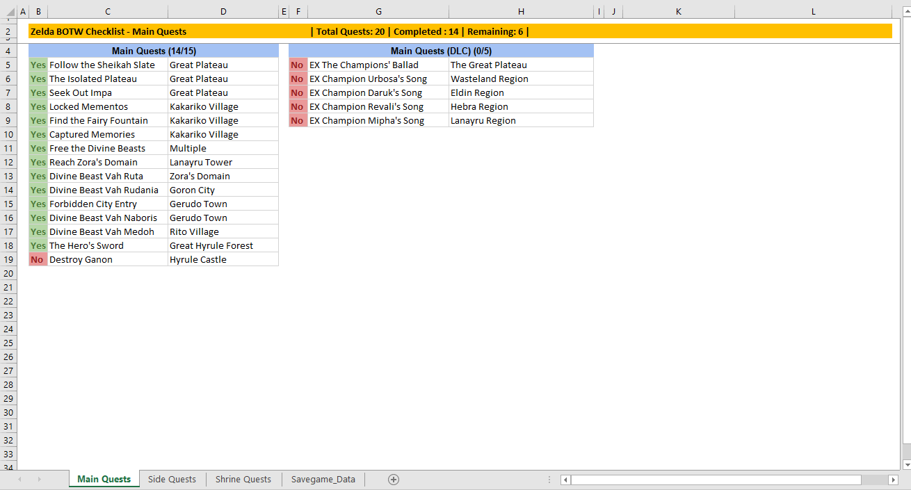

=====================
Zelda BOTW Checklist
=====================

Zelda BOTW Checklist is a python program tha generates quests checklist of Zelda Breath of The Wild game from savegame file.

Basic Usage
----------------------

Savegame file must always be specified::

    zelda-botw-checklist game_data.sav

Savegame file must always be specified. 
Outputile is optional. Default output file is Zelda BOTW Checklist.xslx::

    zelda-botw-checklist game_data.sav Checklist_File

Downloading repository
----------------------

Caso deseje contribuir para este reprositório ou simplesmente prefere baixar diretamente (sem usar o PyPI). Siga as instruções a seguir.
If you wish to contribute or download (without using PyPI). Follow the instructions bellow.

You must have ``git`` e ``pip`` installed in order to download the repo and install dependencies.

Clone repo::

    git clone https://github.com/marlindo71/zelda-botw-checklist

Go to cloned repo folder and install dependencies with ``pip``::

    cd zelda-botw-checklist
    pip install -r requirements.txt

Now you are ready to use zelda-botw-checklist from source code::

    python zelda-botw-checklist game_data.sav  